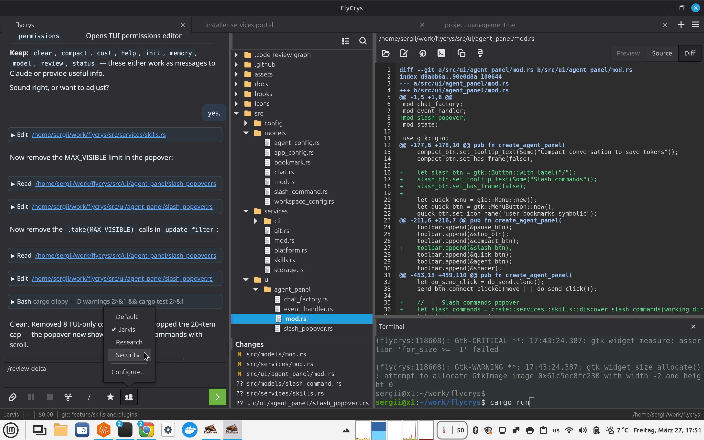
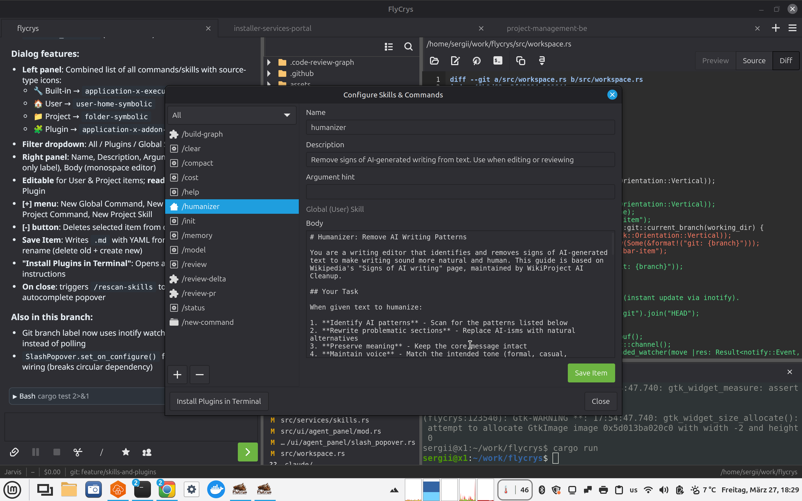

# FlyCrys

**Native Linux GUI for Claude Code agents.** One binary, starts in under a second, no Electron.

[](https://github.com/SergKam/FlyCrys/stargazers)
[](LICENSE)
[](https://github.com/SergKam/FlyCrys/releases/latest)



## Why this exists

I've used Linux exclusively for 30 years. When Claude Code became my daily driver for writing software, the terminal worked but I kept hitting walls: can't preview images, can't see a file tree while the agent works, can't render markdown without switching to a browser, can't juggle multiple project streams without a mess of terminal tabs.

I didn't want Cursor or anything Electron-based. I wanted something native that feels like it belongs on a GTK desktop.

FlyCrys is not an IDE. It doesn't edit files. Agents do. You talk to agents, they write the code. FlyCrys gives you a workspace to manage that workflow: file tree on the left, viewer in the middle, agent chat on the right, terminal at the bottom. That's it.

### What makes it different

- **Only native Linux GUI for Claude Code** — Opcode uses webview, Claude Desktop skips Linux entirely
- **GTK4 native** — follows system theme, integrates with GNOME, minimal resources
- **Workspace-oriented** — not just a chat wrapper; file tree, viewer, terminal, git panel, all wired together
- **Agent profiles** — preconfigured Security, Research, Default agents with custom system prompts and tool restrictions
- **Zero cost** — no subscription, no API proxy, uses your own Claude Code CLI
- **Single binary** — one `cargo build`, one `.deb`, done

## Install

### Debian / Ubuntu (recommended)

```bash
curl -fsSLo /tmp/flycrys.deb https://github.com/SergKam/FlyCrys/releases/latest/download/flycrys_amd64.deb
sudo apt install /tmp/flycrys.deb
```

To upgrade, run the same two commands. The URL always points to the latest release.

### Build from source

```bash
# Ubuntu / Debian
sudo apt install libgtk-4-dev libvte-2.91-gtk4-dev libwebkitgtk-6.0-dev libjavascriptcoregtk-6.0-dev libsoup-3.0-dev

# Fedora
sudo dnf install gtk4-devel vte291-gtk4-devel webkitgtk6.0-devel

# Arch
sudo pacman -S gtk4 vte4 webkitgtk-6.0

git clone https://github.com/SergKam/FlyCrys.git
cd FlyCrys
cargo build --release
./target/release/flycrys
```

### Prerequisites

FlyCrys requires the [Claude Code CLI](https://docs.anthropic.com/en/docs/claude-code):

```bash
npm install -g @anthropic-ai/claude-code
```

## Features

### Agent chat

- Streaming markdown rendering (tables, code blocks, lists, blockquotes)
- Tool calls shown inline with spinners
- Pause, resume, stop agent processes
- Session resume across restarts
- Agent profiles with custom system prompts, tools, and model selection
- Image attachments via clipboard paste or file picker
- Drag files and folders into the prompt
- Bookmarks for reusable prompts
- Clickable file paths in responses open in the viewer
- Token usage and session cost in the status bar

### Slash commands

Type `/` in the input to see all available commands with descriptions. Filters as you type.

Discovers commands from `~/.claude/commands/`, `~/.claude/skills/`, project `.claude/`, and installed plugins. Full CRUD dialog for managing skills and commands.



### File tree

- Lazy-loading tree with system MIME-type icons
- Toolbar: Collapse All, Search (filters across entire project)
- Live refresh via inotify watcher (preserves expand state)
- Right-click: Copy Path, Add to Chat, Open Terminal Here, Open in Default App
- Drag files onto agent input
- Git status coloring in the file tree (files and ancestor folders)
- Git status panel with color-coded changes

### Text viewer

- Three-state mode: Source / Preview / Diff (segmented toggle)
- Syntax highlighting for 25+ languages
- Markdown preview in WebKitGTK
- Image preview with scaling
- Git diff with highlighting

### Run Panel

- Tabbed terminal panel — multiple shell tabs per workspace
- [+] button creates new `bash(N)` tabs; drag-reorder supported
- Right-click tab header: Rename, Copy All Text, Add Selected to Chat, Close
- Background task tracking — auto-creates task tabs when Claude runs `run_in_background` commands
- Task tabs show command, separator, then streamed output from the task file
- Task status indicators: ⏳ running, ✓ completed, ✗ failed (via Claude's `task_notification` events)
- Lazy tab loading — VTE terminals only created on first focus
- Scrollback preserved across sessions per tab
- Colors adapt to light/dark mode

### Workspace

- Multi-tab workspaces, one per project
- Session persistence: window size, pane positions, open files, agent sessions
- Lazy tab loading: only the active tab builds at startup
- Light/dark theme toggle
- Desktop notifications when agents finish
- Git branch in status bar (updates via inotify, not polling)

## Tech stack

| Crate | Purpose |
|-------|---------|
| `gtk4` 0.10 | UI toolkit |
| `webkit6` 0.5 | Chat rendering, markdown preview |
| `vte4` 0.9 | Embedded terminal |
| `syntect` 5 | Syntax highlighting |
| `pulldown-cmark` 0.12 | Markdown to HTML |
| `notify` 6 | Filesystem watcher (inotify) |
| `serde` + `serde_json` | Config persistence, CLI protocol |

System deps: GTK4, VTE4, WebKitGTK 6.0, libsoup 3.0

## License

MIT. See [LICENSE](LICENSE).
