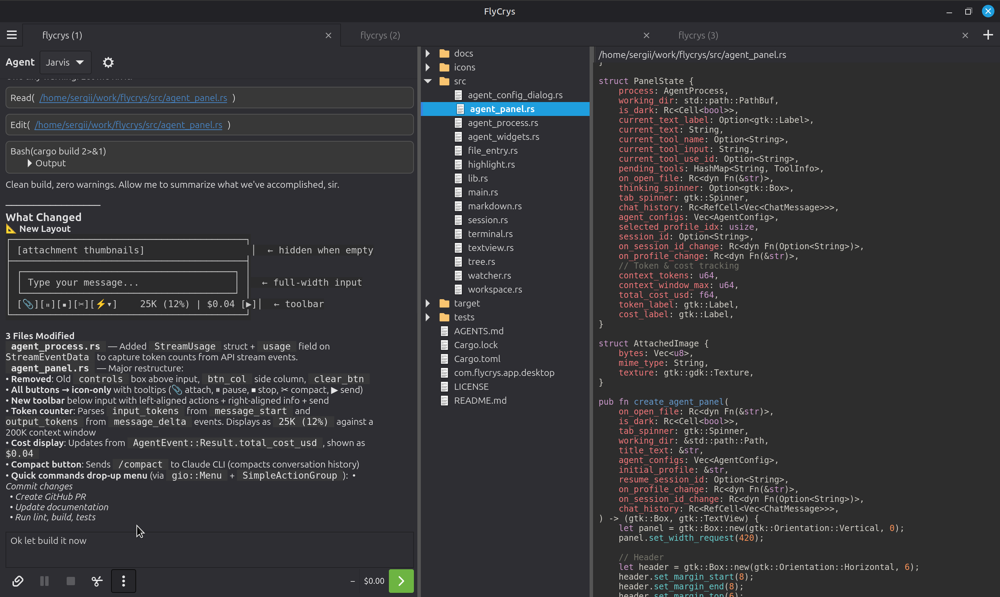

# FlyCrys

> *Fast like a fly, solid like a crystal!*

**Lightning-fast, Linux-native agentic UI on top of Claude Code CLI.**

FlyCrys is not an IDE. It doesn't edit files — agents do. You talk to agents, they write the code. FlyCrys gives you a minimal, focused workspace to orchestrate that workflow without getting in the way.



## Why FlyCrys

- **Purely agentic.** No editor, no keybindings to learn, no plugin ecosystem. You give instructions, agents execute. That's it.
- **Native & fast.** Built in Rust with GTK4 + WebKitGTK. Starts in under a second. No Electron, no browser, no runtime overhead.
- **Minimal by design.** One binary. Small footprint. Does one thing well — lets you work with AI agents on your codebase.
- **Multi-workspace tabs.** One agent per workspace, multiple tabs. Each workspace is a focused session on a project directory.
- **Linux-first.** Built for Linux desktops. Respects your system theme. Feels at home on GNOME, KDE, Sway, i3.

## Install

### Option A — Debian package (recommended)

```bash
curl -fsSLo /tmp/flycrys.deb https://github.com/SergKam/FlyCrys/releases/latest/download/flycrys_amd64.deb
sudo apt install /tmp/flycrys.deb
```

Run the same two commands to upgrade to a newer version. All releases are available at [GitHub Releases](https://github.com/SergKam/FlyCrys/releases).

### Option B — Build from source

**Install system dependencies:**

```bash
# Ubuntu / Debian
sudo apt install libgtk-4-dev libvte-2.91-gtk4-dev libwebkitgtk-6.0-dev libjavascriptcoregtk-6.0-dev

# Fedora
sudo dnf install gtk4-devel vte291-gtk4-devel webkitgtk6.0-devel

# Arch
sudo pacman -S gtk4 vte4 webkitgtk-6.0
```

**Build & run:**

```bash
git clone https://github.com/SergKam/FlyCrys.git
cd FlyCrys
cargo build --release
./target/release/flycrys
```

### Prerequisites

FlyCrys requires [Claude Code CLI](https://docs.anthropic.com/en/docs/claude-code):

```bash
npm install -g @anthropic-ai/claude-code
```

## Features

### Agent Panel

- **Real-time streaming** with markdown rendering (tables, code blocks, lists, blockquotes)
- **Tool calls** shown inline with animated spinners while running
- **Thinking indicator** while the agent reasons
- **Pause / Resume / Stop** agent processes (SIGSTOP / SIGCONT / SIGTERM)
- **Session resume** — continue previous conversations across app restarts
- **Agent profiles** — Default, Security, Research, and custom (name, system prompt, allowed tools, model)
- **Image attachments** — paste from clipboard (Ctrl+V) or pick via file dialog
- **File & folder attachments** — insert paths into prompt from picker dialogs
- **Bookmarks** — save and reuse common prompts (configurable via CRUD dialog)
- **Compact command** — `/compact` to summarize conversation and save tokens
- **Chat history pagination** — loads 100 messages at a time, "Load previous" for older ones
- **Clickable file paths** in responses open files directly in the viewer
- **Tab spinner** indicates which workspace's agent is actively working
- **Token usage** and **session cost** displayed in status bar

### File Tree

- **Lazy-loading** tree with TreeListModel — subdirectories fetched only on expand
- **System MIME-type icons** for all files (via `gio::content_type_guess`)
- **Toolbar** with Collapse All and Search buttons
- **File search** — IDE-style incremental search across the entire project (up to 200 results)
- **Auto-refresh** via filesystem watcher (200ms debounce, preserves expand state)
- **Right-click context menu** — Copy Path, Add to Chat, Open Terminal Here, Open in Default App, Edit in Text Editor, Open in Browser
- **Drag & drop** files onto agent input to reference them
- **Git status panel** — shows modified, added, deleted, untracked files with color-coded indicators (auto-refreshes every 5s)
- `.git`, `target`, `node_modules` directories hidden automatically

### Text Viewer

- **3-state mode switch** — Source, Preview, Diff (linked segmented buttons)
- **Syntax highlighting** for 25+ languages via syntect
- **Line numbers** with auto-sizing gutter
- **Markdown preview** rendered in WebKitGTK
- **Image preview** with content-fit scaling
- **Git diff view** — unified diff with syntax highlighting (tries HEAD → unstaged → staged)
- **Toolbar actions** — Open (default app), Edit in text editor, Open in browser, Terminal here, Copy path, Add to chat
- **10 MB file size guard** — large files show a warning instead of hanging

### Terminal

- **Embedded VTE4 terminal** with full PTY support
- **Shell detection** — uses `$SHELL` or falls back to `/bin/bash`
- **"Terminal here"** — spawns or `cd`s into file/folder directory
- **Scrollback persistence** — terminal content saved/restored across sessions (10,000 lines)
- **Theme-aware colors** — adapts palette to light/dark mode

### Workspace & Session

- **Multi-tab workspaces** — one per project directory, reorderable tabs
- **Full session persistence** — window size, pane positions, open files, agent sessions, theme, all autosaved every 5s
- **Lazy tab loading** — only active tab built at startup, others materialize on first switch
- **Status bar** — agent name, token usage, session cost, git branch, working directory path

### Theme & Settings

- **Light / Dark theme** toggle with native GTK integration
- **Desktop notifications** toggle for agent activity
- **About dialog** with Claude CLI version detection and GitHub link
- **Per-workspace settings** — agent profile, panel mode, pane positions all persisted independently

## Project Structure

```
src/
  config/                            Constants, domain enums, theme CSS
    constants.rs                     All magic numbers, file type maps, known editors/browsers
    types.rs                         Theme, PanelMode, NotificationLevel, AgentOutcome, TreeItemKind
    theme.rs                         Light/dark CSS generation

  models/                            Pure data structures (no I/O, no GTK)
    app_config.rs                    AppConfig (window state, theme, notifications)
    workspace_config.rs              WorkspaceConfig (pane sizes, panel mode, agent sessions)
    agent_config.rs                  AgentConfig (name, system prompt, tools, model)
    chat.rs                          ChatMessage enum (user, assistant, tool, system)

  services/                          Business logic and I/O (no GTK)
    storage.rs                       Config/session/agent/bookmark persistence
    platform.rs                      xdg-open, editor/browser detection, default shell
    git.rs                           Git CLI: status, diff, branch
    cli/
      mod.rs                         AgentBackend trait, AgentDomainEvent, AgentSpawnConfig
      claude.rs                      Claude CLI: process spawn, stream-json parsing, event translation

  ui/                                GTK UI sub-modules
    agent_panel/
      mod.rs                         Agent panel construction and wiring
      state.rs                       AgentProcessState, TokenState, ChatState, PanelConfig
      event_handler.rs               AgentDomainEvent → UI updates
      chat_factory.rs                Chat history rendering (append/prepend)

  main.rs                            App entry, window setup, tab management, settings menu
  workspace.rs                       Workspace layout, pane wiring, file-open pipeline
  textview.rs                        File viewer with source/preview/diff modes
  tree.rs                            File tree panel (TreeListModel, search, collapse)
  chat_webview.rs                    WebKitGTK chat rendering (HTML/JS, streaming, themes)
  chat_entry.rs                      Agent input widget (multi-line, paste, send)
  agent_widgets.rs                   Chat message widget builders
  agent_config_dialog.rs             Agent profile CRUD dialog
  bookmark_dialog.rs                 Bookmark CRUD dialog
  git_panel.rs                       Git status/diff UI panel
  highlight.rs                       Syntax highlighting via syntect
  markdown.rs                        Markdown → HTML converter
  terminal.rs                        VTE4 terminal wrapper with scrollback persistence
  file_entry.rs                      GObject subclass for tree model items
  watcher.rs                         Filesystem change watcher
  session.rs                         Thin re-export layer (models + storage)
```

## Tech Stack

| Crate | Purpose |
|-------|---------|
| `gtk4` 0.10 (v4_12) | UI toolkit (GTK4 Rust bindings) |
| `webkit6` 0.5 | WebKitGTK for chat rendering and markdown preview |
| `vte4` 0.9 | Embedded terminal emulator |
| `syntect` 5 | Syntax highlighting (25+ languages) |
| `pulldown-cmark` 0.12 | Markdown → HTML |
| `notify` 6 | Filesystem watcher (inotify) |
| `dirs` 6 | XDG-compliant config/data paths |
| `serde` + `serde_json` | Config persistence and Claude CLI stream-json protocol |
| `base64` 0.22 | Image encoding for attachments |
| `uuid` 1 | Workspace and session IDs |
| `libc` 0.2 | Process signal handling (SIGSTOP/SIGCONT/SIGTERM) |

**System dependencies:** `libgtk-4-dev`, `libvte-2.91-gtk4-dev`, `libwebkitgtk-6.0-dev`
**Target OS:** Linux (Debian/Ubuntu, Fedora, Arch)

## Philosophy

FlyCrys is deliberately simple. The goal is a fast, stable, minimal surface for agentic development — not another feature-heavy IDE. FlyCrys handles one thing: giving you a clean window into your codebase and your agent.

Contributions that keep things simple and fast are welcome. Features that add complexity without clear agentic value are not.

## License

MIT License — see [LICENSE](LICENSE) for details.
